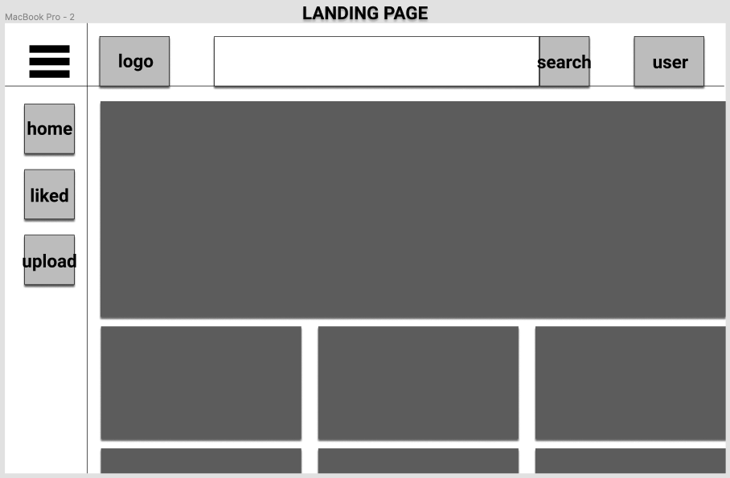
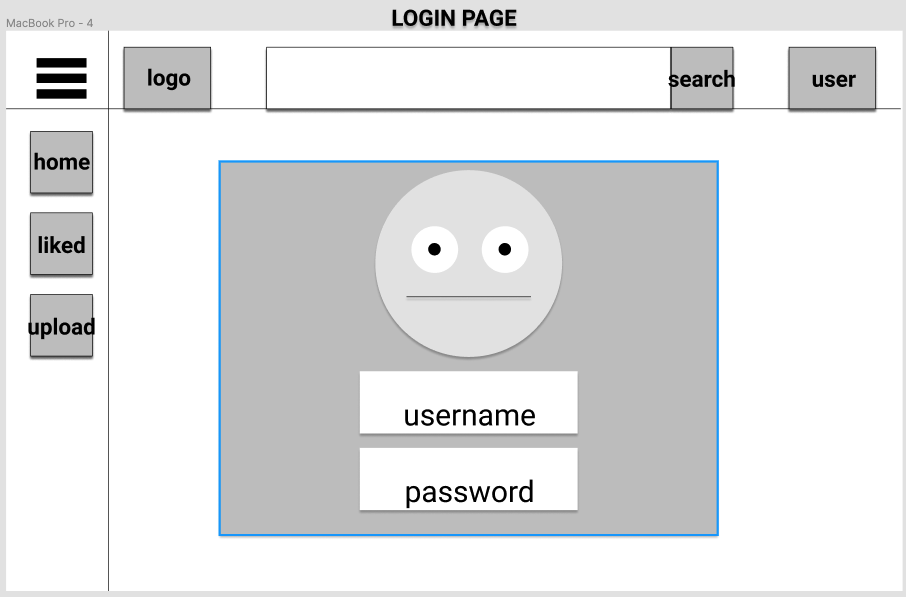
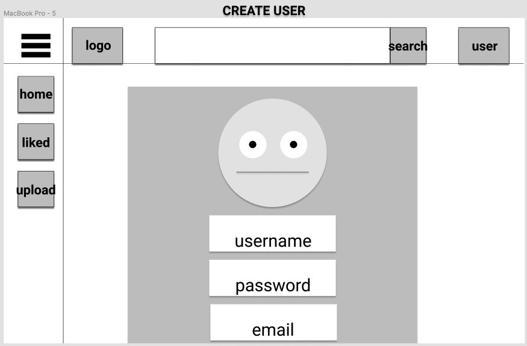
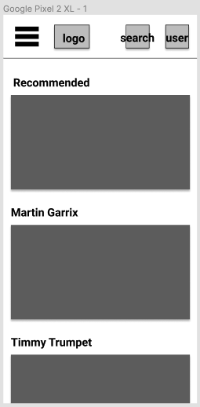
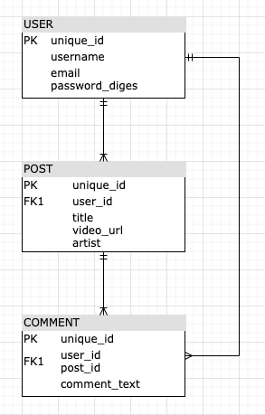

# PROJECT 4


- [Full Stack Project](#Full-Stack-Project)
  - [Overview](#Overview)
    - [Team Members](#Team-Members)
    - [Team Expectations](#Team-Expectations)
    - [Permissions](#Permissions)
  - [MVP](#MVP)
    - [MVP Goals](#MVP-Goals)
    - [MVP Libraries](#MVP-Libraries)
    - [MVP Client (Front End)](#MVP-Client-Front-End)
      - [Wireframes](#Wireframes)
      - [Component Hierarchy](#Component-Hierarchy)
      - [Component Breakdown](#Component-Breakdown)
      - [Component Estimates](#Component-Estimates)
    - [MVP Server (Back End)](#MVP-Server-Back-End)
      - [ERD Model](#ERD-Model)
      - [Data Heirarchy](#Data-Heirarchy)
  - [Post-MVP](#Post-MVP)
  - [Project Delivery](#Project-Delivery)
  - [Code Showcase](#Code-Showcase)
  - [Code Issues & Resolutions](#Code-Issues--Resolutions)

<br>

## Overview

_**IEDB** is the International EDM Database where you can find the latest releases, live performances and information of your favourite DJ's!_

### Created by

Created, designed, developed, directed, put together, assembled, and written by Richard M. Braamburg.

### Permissions

All information used in **IEDB** are gathered from online free resources. New content can be added by users by providing URL's to the respective sources. Video footage will be gathered from online platforms like Youtube and Vimeo as long as the original user allows embedding the source.

<br>

## MVP

_The **IEDB** minimum requirements for the app are to provide a public overview of video footage of EDM songs and show recordings. Additionally, an online portal will be created whereby users get the option to add new content by saving to the database. Also, every users gets the ability to comment on items in the DB._

<br>

### MVP Goals

- _Every visitor of the website should have access to all content in the DB (viewing permission)_
- _Users should have the ability to upload new content, edit their own content, delete their own content._
- _Users should have the ability to change user settings and credentials - reset password and change username etc._
- _Users should be able to like / save posts to create their own favourites list._
- _Users should be able to search for videos on title name_

<br>

### MVP Libraries

|     Library      | Description                                                                       |
| :--------------: | :-------------------------------------------------------------------------------- |
|      React       | _Front end - renders HTML, adds functionality to teh site, and accesses DB._      |
|   React Router   | _Allows user to navigate through the website -> auto directs when not logged in._ |
|  Ruby on Rails   | _Backend - database and auth._                                                    |
| Ruby Controllers | _Create full CRUD endpoints (RESTful API)._                                       |

<br>

### MVP Client (Front End)

#### Wireframes



- Desktop Landing



- Login Page



- Register Page



- Mobile Page

#### Component Hierarchy

```structure

src
|__ assets/
      |__ fonts
      |__ graphics
      |__ images
|__ components/
      |__ Header.js
      |__ Logo.js
      |__ Footer.js
      |__ Main.js
      |__ Gallery.js
      |__ Login.js
      |__ LoginAnimation.js
      |__ Register.js
      |__ Upload.js
      |__ Favourites.js
      |__ SingleVideo.js
      |__ Comments
|__ services/
      |__ ApiHelper.js

```

#### Component Breakdown

|   Component    |    Type    | state | props | Description                                                                                |
| :------------: | :--------: | :---: | :---: | :----------------------------------------------------------------------------------------- |
|     Header     | functional |   n   |   y   | _The header will contain nav / logo / search._                                             |
|      Logo      | functional |   n   |   n   | _Logo will be interactive hence the seperate component._                                   |
|     Footer     | functional |   n   |   n   | _The footer will contain static data / links._                                             |
|      Main      |   class    |   y   |   y   | _Container class that contains all other elements that will be rendered._                  |
|    Gallery     |   class    |   y   |   y   | _Overview of all videos available on the page._                                            |
|     Login      |   class    |   y   |   y   | _Login component._                                                                         |
| LoginAnimation | functional |   n   |   n   | _Login will have an SVG animation that is rendered seperately._                            |
|    Register    |   class    |   y   |   y   | _Register component._                                                                      |
|     Upload     |   class    |   y   |   y   | _Users can upload / create / delete content, upload will enable the upload functionality._ |
|   Favourites   | functional |   n   |   n   | _Overview of videos likes by the user._                                                    |
|  SingleVideo   | functional |   n   |   n   | _Render of one video + CRUD functionality and comment section._                            |
|    Comments    |   class    |   y   |   y   | _Comment component is rendered seperately._                                                |

#### Component Estimates

| Task           | Priority | Estimated Time | Time Invested | Actual Time |
| -------------- | :------: | :------------: | :-----------: | :---------: |
| Header         |    L     |     3 hrs      |     - hrs     |     TBD     |
| Logo           |    L     |     3 hrs      |     - hrs     |     TBD     |
| Footer         |    L     |     1 hrs      |     - hrs     |     TBD     |
| Main           |    H     |     6 hrs      |     - hrs     |     TBD     |
| Gallery        |    H     |     6 hrs      |     - hrs     |     TBD     |
| Login          |    H     |     5 hrs      |     - hrs     |     TBD     |
| LoginAnimation |    L     |     12 hrs     |     - hrs     |     TBD     |
| Register       |    H     |     4 hrs      |     - hrs     |     TBD     |
| Upload         |    H     |     5 hrs      |     - hrs     |     TBD     |
| Favourites     |    L     |     12 hrs     |     - hrs     |     TBD     |
| SingleVideo    |    H     |     3 hrs      |     - hrs     |     TBD     |
| Comments       |    H     |     8 hrs      |     - hrs     |     TBD     |
| Unforeseen     |    H     |     12 hrs     |     - hrs     |     TBD     |
| TOTAL          |          |     80 hrs     |     - hrs     |     TBD     |

<br>

### MVP Server (Back End)

#### ERD Model



#### Data Heirarchy

```structure

database_db
|__ users/
|__ posts/
|__ comments/

```

<br>

---

## Post-MVP

> Use this section to document ideas you've had that would be fun (or necessary) for your Post-MVP. This will be helpful when you return to your project after graduation!

---

## Project Delivery

> The Delivery section should be expanded and revised as you work on your project.

## Code Showcase

> Use this section to include a brief code snippet of functionality that you are proud of and a brief description.

## Code Issues & Resolutions

> Use this section to list of all major issues encountered and their resolution, if you'd like.

---
